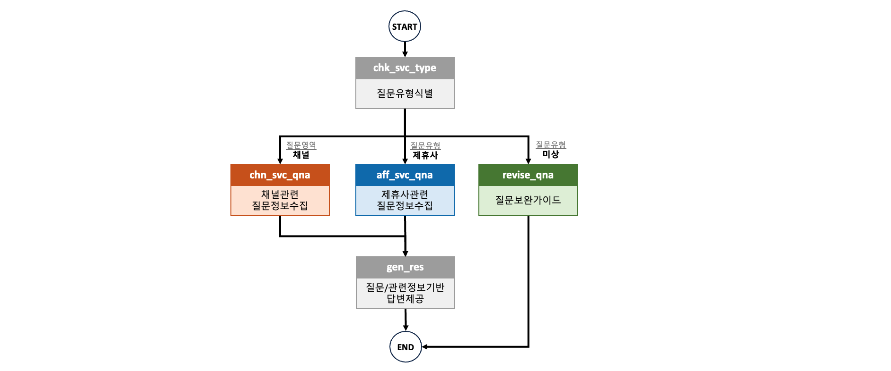

# llm-foundation-lab-project

## 0. 프로젝트 소개
### 0-1. T우주 외부 서비스 제공 영역 소개
T우주 외부 제공 서비스는 크게 상품 및 계약의 상태를 조회하는 **1) 채널 연동 서비스**와 실제 연동형 상품을 제공하기 위해 제휴사와 가입/해지/갱신 등을 처리하는 **2) 제휴사 연동 서비스**로 구성

### 0-2. T우주 서비스 제공 영역별 주요 Q&A
다수의 고객에게 다양한 제휴사의 상품을 제공하는 T우주 서비스의 특성상 다양한 이해관계자를 통해 문의 및 요청이 인입
특히 서비스 출시 준비 단계에서 **1) 채널사/제휴사 기획/개발 담당자**와 **2) QA 담당자**의 문의가 크게 증가하고 서비스 출시가 완료되면 **3) 고객센터**를 통한 실제 고객이나 사용자(대리점/판매점 직원 등)의 문의 및 요청이 증가함
**채널 연동 서비스**의 경우, 주로 이미 **제공된 가이드 문서를 참조**하여 별도 요청 없이 **자체적으로 해결 가능**한 문제가 많으나 정확히 문서를 숙지하지 않은 상태로 문의나 요청이 발생하는 경우가 많음
**제휴사 연동 서비스**의 경우, T우주와 실제 상품을 제공하는 제휴사간 시점마다 발생한 **연동 이력을 확인**(DB 조회)해야 **문의나 요청에 정확하게 댭변이 가능**한 경우가 많음 

### 0-3. 프로젝트 목적 및 수행 범위
**목적** : T우주 외부 제공 서비스 관련 문의 및 요청에 대해 실제 운영자에게 문의나 요청이 전달되기 전에 해결책을 제시하여 **요청자**(고객을 포함한 이해관계자)**의 대기 시간 및 운영 비용 최소화**  
**수행범위**
- 채널 연동 Q&A : 가이드 문서의 주요 문제 발생 원인과 해결책을 기반으로 문제를 해결할 수 있도록 가이드 (전체 채널 연공 관련 문의/요청의 약 90% 해당) 
- 제휴사 연동 Q&A : 특정 고객/계약에 대한 연동 이력을 추출하고 이를 기반으로 문제을 해결할 수 있도록 가이드 (전체 제휴사 연공 관련 문의/요청의 약 90% 해당) 
- 기타 : 정확하게 질문 의도를 파악할 수 없는 경우 사용자가 질문을 스스로 개선할 수 있도록 가이드

## 1. 공통/부가 서비스 구현

### 1-1. 공통 환경변수 및 설정 구현

### 1-2. Q&A 영역 분류 서비스 구현

### 1-3. 질의 보완 서비스 구현

### 1-4. 최종 답변 서비스 구현

## 2. 제휴사 연동 서비스 Q&A 구현

### 2-1. 제휴사 Q&A 데이터 구성

### 2-2. 제휴사 연동 서비스 구현

## 3. 채널 연동 서비스 Q&A 구현

### 3-1. 채널 Q&A 데이터 구성

### 3-2. 채널 연동 서비스 구현

## 4. 그래프 구성 및 결과 수행

### 4-1. 그래프 구성

### 4-2. 결과 수행
