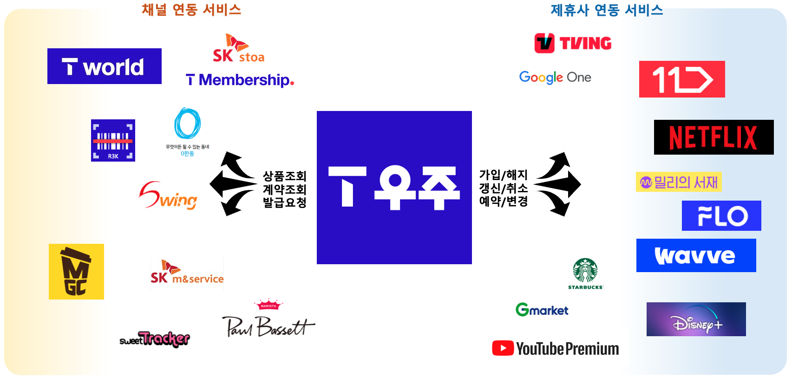
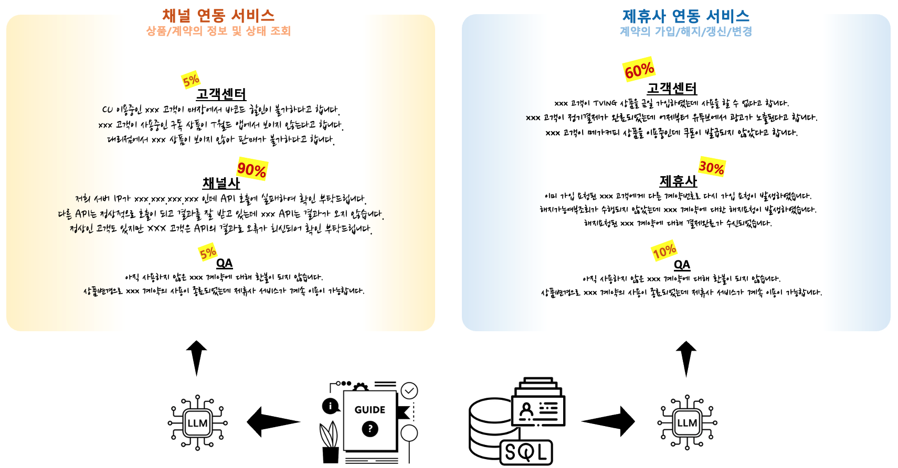
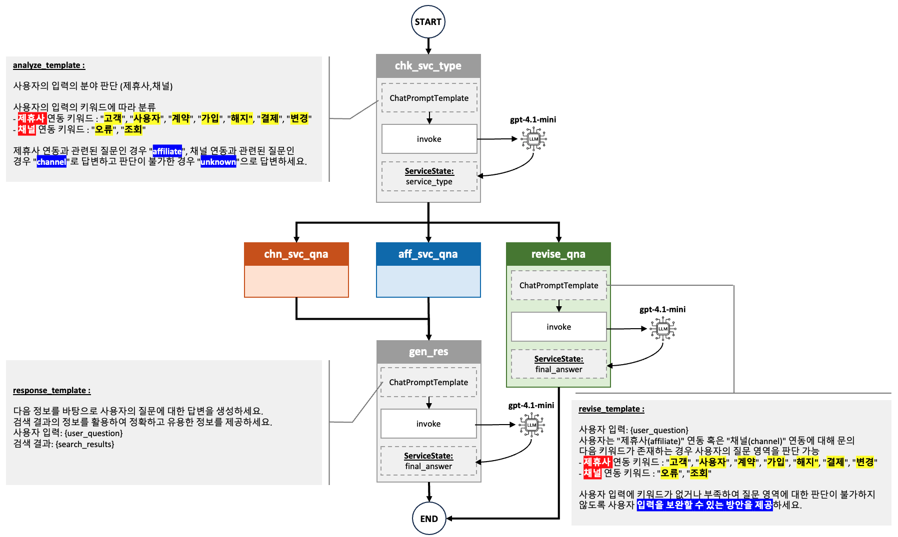

# llm-foundation-lab-project

## 0. 프로젝트 소개

### 0-1. T우주 외부 서비스 제공 영역 소개
T우주 외부 제공 서비스는 크게 상품 및 계약의 상태를 조회하는 **1) 채널 연동 서비스**와 실제 연동형 상품을 제공하기 위해 제휴사와 가입/해지/갱신 등을 처리하는 **2) 제휴사 연동 서비스**로 구성

### 0-2. T우주 서비스 제공 영역별 주요 Q&A

## 1. 공통 구현

### 1-1. Q&A 영역 분류 서비스 구현

### 1-2. 질의 보완 서비스 구현

### 1-2. 최종 답변 서비스 구현

## 2. 제휴사 연동 서비스 Q&A 구현

### 2-1. 제휴사 Q&A 데이터 구성

### 2-2. 제휴사 연동 서비스 데이터 구성

## 3. 채널 연동 서비스 Q&A 구현

### 3-1. 채널 Q&A 데이터 구성

### 3-2. 제휴사 연동 서비스 데이터 구성

## 4. 그래프 구성 및 결과 수행
