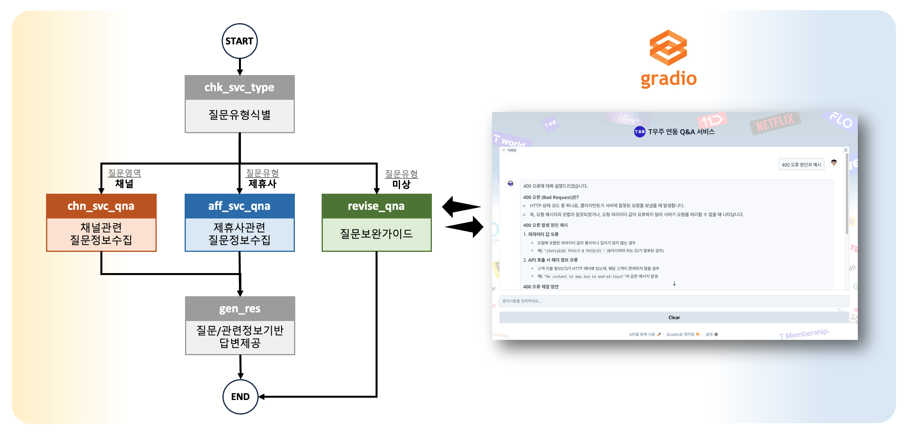
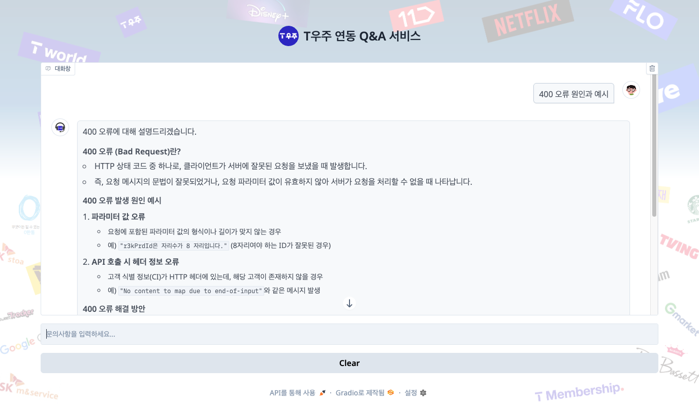
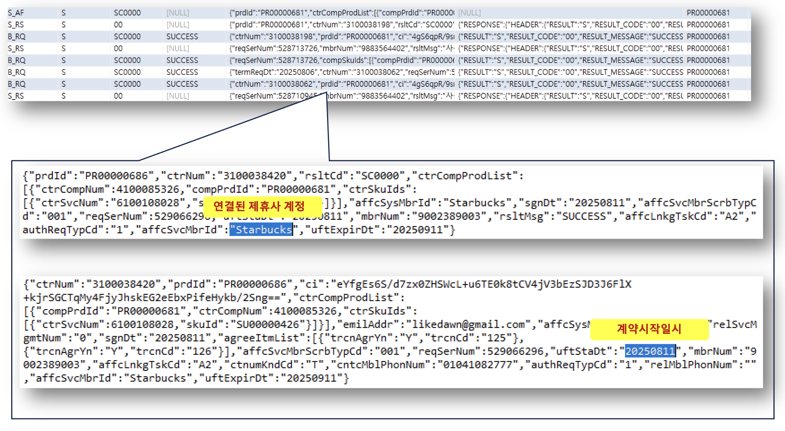

# T우주 연동 Q&A 서비스 구현 프로젝트

## 0. 프로젝트 소개
### 0-1. 프로젝트 배경 - T우주 외부 서비스 제공 영역 소개
T우주 외부 제공 서비스는 크게 상품 및 계약의 상태를 조회하는 **1) 채널 연동 서비스**와 실제 연동형 상품을 제공하기 위해 제휴사와 가입/해지/갱신 등을 처리하는 **2) 제휴사 연동 서비스**로 구성


### 0-1. T우주 서비스 제공 영역별 주요 Q&A
다수의 고객에게 다양한 제휴사의 상품을 제공하는 T우주 서비스의 특성상 다양한 이해관계자를 통해 문의 및 요청이 인입
특히 서비스 출시 준비 단계에서 **1) 채널사/제휴사 기획/개발 담당자**와 **2) QA 담당자**의 문의가 크게 증가하고 서비스 출시가 완료되면 **3) 고객센터**를 통한 실제 고객이나 사용자(대리점/판매점 직원 등)의 문의 및 요청이 증가함
**채널 연동 서비스**의 경우, 주로 이미 **제공된 가이드 문서를 참조**하여 별도 요청 없이 **자체적으로 해결 가능**한 문제가 많으나 정확히 문서를 숙지하지 않은 상태로 문의나 요청이 발생하는 경우가 많음
**제휴사 연동 서비스**의 경우, T우주와 실제 상품을 제공하는 제휴사간 시점마다 발생한 **연동 이력을 확인**(DB 조회)해야 **문의나 요청에 정확하게 댭변이 가능**한 경우가 많음 


### 0-2. 프로젝트 목적 및 수행 범위
**목적** : T우주 외부 제공 서비스 관련 문의 및 요청에 대해 실제 운영자에게 문의나 요청이 전달되기 전에 해결책을 제시하여 **요청자**(고객을 포함한 이해관계자)**의 대기 시간 및 운영 비용 최소화**  
**수행범위**
- 채널 연동 Q&A : 가이드 문서의 주요 문제 발생 원인과 해결책을 기반으로 문제를 해결할 수 있도록 가이드 (전체 채널 연공 관련 문의/요청의 약 90% 해당) 
- 제휴사 연동 Q&A : 특정 고객/계약에 대한 연동 이력을 추출하고 이를 기반으로 문제을 해결할 수 있도록 가이드 (전체 제휴사 연공 관련 문의/요청의 약 90% 해당) 
- 기타 : 정확하게 질문 의도를 파악할 수 없는 경우 사용자가 질문을 스스로 개선할 수 있도록 가이드


## 1. 공통/부가 서비스 구현


## 2. 채널 연동 서비스 Q&A 구현

### 2-1. 채널 Q&A 데이터 구성
채널 관련 발생 가능한 주요 오류는 채널사에 제공된 가이드 문서에 다음과 같이 제공되고 있음 (사람이 문서로 관리할 수 있는 수준의 비교적 간단한 형태의 데이터)
이 프로젝트에서는 해당 가이드 문서를 참조하여 작성한 별도 파일(형식:md파일)을 Chroma DB에 적재하여 프로젝트 환경을 구성 

### 2-2. 채널 연동 서비스 구현


## 3. 제휴사 연동 서비스 Q&A 구현

### 3-1. 제휴사 Q&A 데이터 구성
제휴 관련 문의를 해결하기 위해서는 일반적으로 다음과 같은 다중 테이블을 조인하여 운영자가 직접 확인이 필요 (운영자가 직접 개입하여 확인이 필요한 수준의 복잡한 형태의 데이터)
이 프로젝트에서는 검증 환경의 조회 결과 일부를 발췌(형식:csv파일)하고 이를 다시 SQLite에 업로드하여 프로젝트 환경을 구성


### 3-2. 제휴사 연동 서비스 구현


## 4. 그래프 구성 및 결과 수행

### 4-1. 그래프 구성
다음은 그래프 구성 결과를 다음 명령어로 출력한 결과임

```display(Image(graph.get_graph().draw_mermaid_png()))```


### 4-2. 결과 수행

### 4-3. 평가


## 5. 향후개선점

### 5-1. [제휴사 연동] Databse 직접 연결

### 5-2. [제휴사 연동] 이력간 발생 관계를 고려한 결과 도출

### 5-3. [제휴사 연동] 이력내 구조화된 정보를 고려한 결과 도출


### 5-4. [채널 연동] 데이터 송수신 이력 연결

## 6. 기타

### 6-1. 실행 방법
1. uv 환경에서 src 디렉토리의 main.py 파일을 실행 (터미널에서 다음 명령어 수행)

``` uv run python src/main.py```  

2. 터미널에 granas에서 제공하는 URL을 브라우저를 통해 접근 (포트 번호는 실행시마다 변경)

``` http://127.0.0.1:XXXX```


### 6-2. 데이터 적재 방법
1.  제휴/고객 데이터 적재 : SQLite DB 적재 - 터미널에서 다음 명령어 수행

``` uv run python src/load_affiliate_data.py```
``` uv run python src/load_member_data.py```  

2.  채널 데이터 적재 : Chroma DB 적재 - 터미널에서 다음 명령어 수행

``` uv run python src/load_channel_data.py```

3.  프롬프트 등록 : Langfuze 온라인 등록 - 터미널에서 다음 명령어 수행

``` uv run python src/load_langfuze_data.py```


